# RatInABox    [](https://badge.fury.io/py/ratinabox) [](https://pepy.tech/project/ratinabox)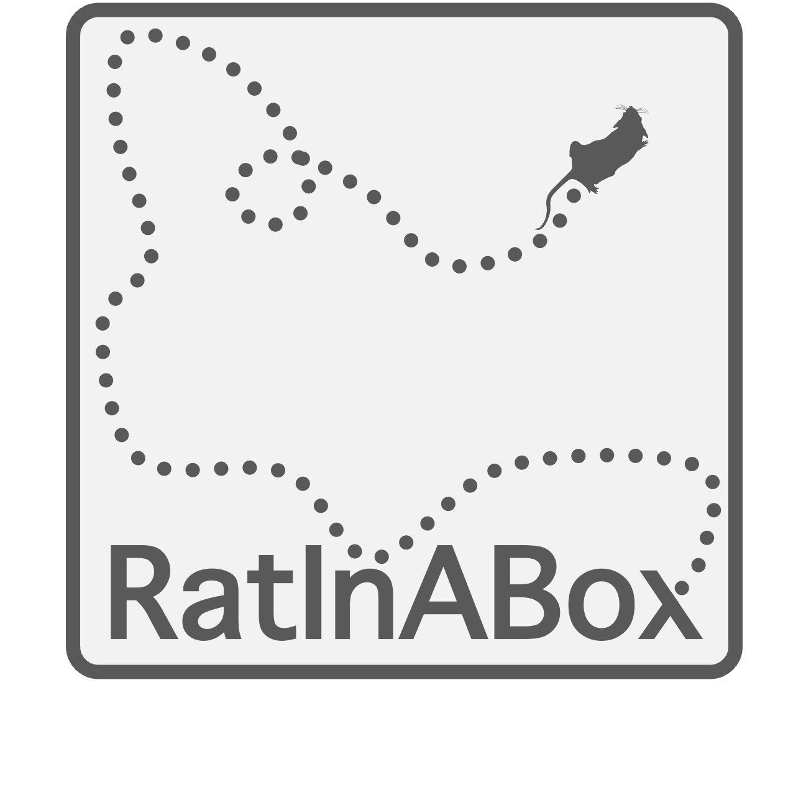 

`RatInABox` (see [paper](https://elifesciences.org/articles/85274)) is a toolkit for generating synthetic behaviour and neural data for spatially and/or velocity selective cell types in complex continuous environments. 

[**Install**](#installing-and-importing) | [**Demos**](#get-started) | [**Features**](#feature-run-down) | [**Contributions and Questions**](#contribute) | [**Cite**](#cite)


With `RatInABox` you can: 

* **Generate realistic trajectories** for rats exploring complex 1 and 2D environments under a smooth random policy, an external control signal, or your own trajectory data.
* **Generate artificial neuronal data** for various location- or velocity-selective cells found in the brain (e.g., but not limited to, Hippocampal cell types), or build your own more complex cell types. 
* **Build and train complex multi-layer networks** of cells, powered by data generated with `RatInABox`. 

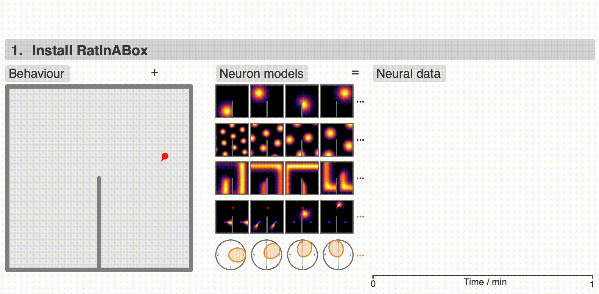

`RatInABox` is an open source project welcoming [contributions](#contribute). If you use `RatInABox` please [cite](#cite) the paper and consider giving this repository a star ☆. It contains three classes: 

1. `Environment()`📦: The environment/maze (or "box") that the agent lives in. 1- or 2-dimensional.
2. `Agent()`      🐀: The agent (or "rat") moving around the `Environment`. 
3. `Neurons()`    🧠: A population of neurons with firing rates determined by the state (position and velocity) of the `Agent`. Make your own or use one of our premade cell types including: 
    * `PlaceCells()`
    * `GridCells()`
    * `BoundaryVectorCells()` (egocentric or allocentric)
    * `ObjectVectorCells()`
    * `VelocityCells()`
    * `SpeedCells()`
    * `FieldOfViewNeurons()` (egocentric encoding of what the `Agent` can see)
    * `RandomSpatialNeurons()`
    * `HeadDirectionCells()`
    * `FeedForwardLayer()` (a generic class analagous to a feedforward layer in a deep neural network)
    * `NeuralNetworkNeurons()` (a generic class analagous to a deep neural network)
    * `SuccessorFeatures()` 
    * ...

The top animation shows an example use case: an `Agent` randomly explores a 2D `Environment` with a wall. Three populations of `Neurons` (`PlaceCells`, `GridCells`, `BoundaryVectorCells`) fire according to the receptive fields shown. All data is saved into the history for downstream use. `RatInABox` is fully continuous in space; this means that position and neural firing rates are calculated rapidly online with float precision rather than pre-calculated over a discretised mesh. `RatInABox` is flexibly discretised in time; `dt` can be set by the user (defaulting to 10 ms) depending on requirements.


## Key features
* **Non-specific**: Trajectories can be randomly generated, imported, or adaptively controlled making `RatInABox` a powerful engine for many tasks involving continuous motion (e.g. control theory or [reinforcement learning](#policy-control)). 
* **Biological**:   Simulate large populations of spatially and/or velocity modulated cell types. Neurons can be rate based or spiking. The random motion model is fitted to match real rodent motion. 
* **Flexible**:     Simulate environments in 1D or 2D with arbitrarily wall, boundary and hole arrangements.  Combine premade or bespoke `Neurons` classes into arbitrary deep networks (examples given).
* **Fast**:         Simulating 1 minute of exploration in a 2D environment with 100 place cells (dt=10 ms) take just 2 seconds on a laptop (no GPU needed).
* **Precise**:      No more prediscretised positions, tabular state spaces, or jerky movement policies. It's all continuous. 
* **Easy**:         Sensible default parameters mean you can have realisitic simulation data to work with in <10 lines of code.
* **Visual**        Plot or animate trajectories, firing rate timeseries', spike rasters, receptive fields, heat maps, velocity histograms...using the plotting functions ([summarised here](./demos/list_of_plotting_fuctions.md)). 

<!-- 
## Announcement about support for OpenAI's `gymnasium`  API
A new wrapper contributed by [@SynapticSage](https://github.com/SynapticSage) allows `RatInABox` to natively support OpenAI's [`gymnasium`](https://gymnasium.farama.org) API for standardised and multiagent reinforment learning. This can be used to flexibly integrate `RatInABox` with other RL libraries such as Stable-Baselines3 etc. and to build non-trivial tasks with objectives and time dependent rewards. Check it out [here](https://github.com/RatInABox-Lab/RatInABox/blob/main/ratinabox/contribs/TaskEnv_example_files/TaskEnvironment_basics.md). -->

## Get started 
Many [demos](./demos/) are provided. Reading through the [example scripts](#example-scripts) (one simple and one extensive, duplicated at the bottom of the readme) these should be enough to get started. We also provide numerous interactive jupyter scripts as more in-depth case studies; for example one where `RatInABox` is used for [reinforcement learning](./demos/reinforcement_learning_example.ipynb), another for [neural decoding](./demos/decoding_position_example.ipynb) of position from firing rate. Jupyter scripts reproducing all figures in the [paper](./demos/paper_figures.ipynb) and [readme](./demos/readme_figures.ipynb) are also provided. All [demos](./demos/) can be run on Google Colab [](./demos/)

## Installing and Importing
**Requirements** are minimal (`python3`, `numpy`, `scipy` and `matplotlib`, listed in `setup.cfg`) and will be installed automatically. 

**Install** the latest, stable version using `pip` at the command line with
```console
$ pip install ratinabox
```
Alternatively, in particular if you would like to develop `RatInABox` code or if you want the bleeding edge (may occasioanlly break), install from this repo using  
```console
$ git clone --depth 1 https://github.com/RatInABox-Lab/RatInABox.git
$ cd RatInABox
$ pip install -e .
```
n.b. the "editable" `-e` handle means changes made to your clone will be reflected when you next import `RatInABox` into your code.

**Import** into your python project with  
```python
import ratinabox
from ratinabox.Environment import Environment
from ratinabox.Agent import Agent
from ratinabox.Neurons import PlaceCells, GridCells #...
```

## Feature run-down
Here is a list of features loosely organised into those pertaining to 

(i) the [`Environment`](#i-environment-features)
* [Adding walls](#walls)
* [Complex Environments: Polygons, curves and holes](#complex-environments-polygons-curves-and-holes)
* [Objects](#objects)
* [Boundary conditions](#boundary-conditions)
* [1- or 2-dimensions](#1--or-2-dimensions) 

(ii) the [`Agent`](#ii-agent-features)
* [Random motion](#random-motion-model)
* [Importing trajectories](#importing-trajectories)
* [Policy control](#policy-control)
* [Wall repelling](#wall-repelling)
* [Multiple Agents](#multiple-agents)
* [Advanced `Agent` classes](#advanced-agent-classes)

(iii) the [`Neurons`](#iii-neurons-features).
* [Cell types](#multiple-cell-types) 
* [Noise](#noise)
* [Spikes vs rates](#spiking)
* [Plotting rate maps](#rate-maps)
* [Place cell models](#place-cell-models) 
* [Place cell geometry](#geometry-of-placecells)
* [Egocentric encodings](#egocentric-encodings)
* [Reinforcement learning and successor features](#reinforcement-learning-and-successor-features)
* [Deep neural networks](#neurons-as-function-approximators)
* [Create your own `Neuron` types](#creating-your-own-neuron-types)

(iv) [Figures and animations plotting](#iv-figures-and-animations)

Specific details can be found in the [paper](https://www.biorxiv.org/content/10.1101/2022.08.10.503541v3). 


### (i) `Environment` features
#### **Walls**
Arbitrarily add walls to the environment to produce arbitrarily complex mazes:
```python 
Environment.add_wall([[x0,y0],[x1,y1]])
```
Here are some easy to make examples.


#### **Complex `Environment`s: Polygons, curves, and holes**
By default, `Environments` in RatInABox are square (or rectangular if `aspect != 1`). It is possible to create arbitrary environment shapes using the `"boundary"` parameter at initialisation. 

You can also add holes to the `Environment` using the `"holes"` parameter at initialisation. When sampling positions from the Environment (e.g. at initialisation), holes won't be included.

Any curved environments can be made by creating a boundary of many small walls (use sparingly, walls may slow down computations, particular for wall-responsive representations, e.g. boundary vector cells.)

```python 
#A trapezium shaped Environment
Env = Environment(params={
    'boundary':[[0,-0.2],[0,0.2],[1.5,0.5],[1.5,-0.5]],
    })

#An environment with two holes making a figure of 8
Env = Environment(params={
    'aspect':1.8,
    'holes' : [[[0.2,0.2],[0.8,0.2],[0.8,0.8],[0.2,0.8]],
               [[1,0.2],[1.6,0.2],[1.6,0.8],[1,0.8]]],
    })

#A circular environment made from many small walls
Env = Environment(params = {
    'boundary':[[0.5*np.cos(t),0.5*np.sin(t)] for t in np.linspace(0,2*np.pi,100)],
    })
```

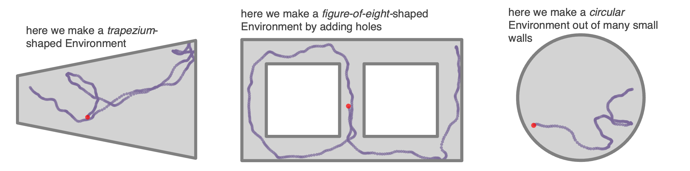

#### **Objects**

`Environment`s can contain objects. These are used by `ObjectVectorCells` as visual cues but in theory you can hijack these to respresent many things in your `Environment` (reward ports, goal locations etc.). Objects have a `type` and a `position`
Objects are defined by a list of points and a position. Objects can be used as visual cues (e.g. for `ObjectVectorCells`) or as obstacles (e.g. for `BoundaryVectorCells`). 

```python
Envirnoment.add_object(object=[0.3,0.3],type=0)
Envirnoment.add_object(object=[0.7,0.3],type=0)
Envirnoment.add_object(object=[0.5,0.7],type=1)
```
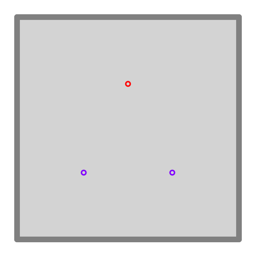


#### **Boundary conditions**
Boundary conditions (for default square/rectangular environments) can be "periodic" or "solid". Place cells and the motion of the Agent will respect these boundaries accordingly. 
```python
Env = Environment(
    params = {'boundary_conditions':'periodic'} #or 'solid' (default)
) 
```


#### **1- or 2-dimensions**
`RatInABox` supports 1- or 2-dimensional `Environment`s. Almost all applicable features and plotting functions work in both. The following figure shows 1 minute of exploration of an `Agent` in a 1D environment with periodic boundary conditions spanned by 10 place cells. 
```python 
Env = Environment(
    params = {'dimensionality':'1D'} #or '2D' (default)
) 
```


### (ii) `Agent` features

#### **Random motion model**
By defaut the `Agent` follows a random motion policy.  Random motion is stochastic but smooth. The speed (and rotational speed, if in 2D) of an Agent take constrained random walks governed by Ornstein-Uhlenbeck processes. You can change the means, variance and coherence times of these processes to control the shape of the trajectory. Default parameters are fit to real rat locomotion data from Sargolini et al. (2006): 

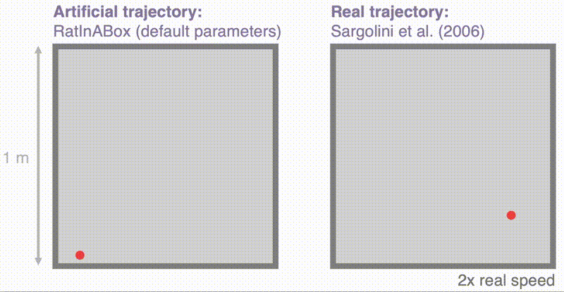

The default parameters can be changed to obtain different style trajectories. The following set of trajectories were generated by modifying the rotational speed parameter `Agent.rotational_velocity_std`:

```python
Agent.speed_mean = 0.08 #m/s
Agent.speed_coherence_time = 0.7
Agent.rotation_velocity_std = 120 * np.pi/180 #radians 
Agent.rotational_velocity_coherence_time = 0.08
```


#### **Importing trajectories**
`RatInABox` supports importing external trajectory data (rather than using the in built random motion policy). Imported data can be of low temporal resolution. It will be smoothly upsampled using a cubic splines interpolation technique. We provide a 10 minute trajectory from the open-source data set of Sargolini et al. (2006) ready to import. In the following figure blue shows (low resolution) trajectory data imported into an `Agent` and purple shows the smoothly upsampled trajectory taken by the `Agent` during exploration. 
```python
Agent.import_trajectory(dataset='sargolini')
#or 
Agent.import_trajectory(times=array_of_times,
                        positions=array_of_positions)

```


#### **Policy control**
By default the movement policy is an random and uncontrolled (e.g. displayed above). It is possible, however, to manually pass a "drift_velocity" to the Agent on each `Agent.update()` step. This 'closes the loop' allowing, for example, Actor-Critic systems to control the Agent policy. As a demonstration that this method can be used to control the agent's movement we set a radial drift velocity to encourage circular motion. We also use RatInABox to perform a simple model-free RL task and find a reward hidden behind a wall (the full script is given as an example script [here](./demos/reinforcement_learning_example.ipynb))
```python
Agent.update(drift_velocity=drift_velocity)
```


#### **Wall repelling**
Under the random motion policy, walls in the environment mildly "repel" the `Agent`. Coupled with the finite turning speed this replicates an effect (known as thigmotaxis, sometimes linked to anxiety) where the `Agent` is biased to over-explore near walls and corners (as shown in these heatmaps) matching real rodent behaviour. It can be turned up or down with the `thigmotaxis` parameter.
```python 
Αgent.thigmotaxis = 0.8 #1 = high thigmotaxis (left plot), 0 = low (right)
```

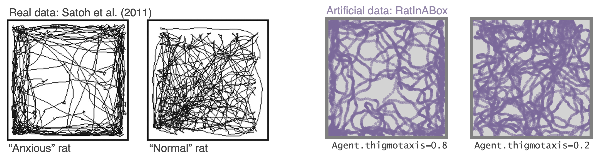

#### **Multiple `Agent`s**
There is nothing to stop multiple `Agent`s being added to the same `Environment`. When plotting/animating trajectories set the kwarg `plot_all_agents=True` to visualise all `Agent`s simultaneously. 

The following animation shows three `Agent`s in an `Environment`. Drift velocities are set so that `Agent`s weally locally attract one another creating "interactive" behaviour.


#### **Advanced `Agent` classes**
One can make more advanced Agent classes, for example `ThetaSequenceAgent()` where the position "sweeps" (blue) over the position of an underlying true (regular) `Agent()` (purple), highly reminiscent of theta sequences observed when one decodes position from the hippocampal populaton code on sub-theta (10 Hz) timescales. This class can be found in the [`contribs`](./ratinabox/contribs/) directory. 


### (iii) `Neurons` features 

#### **Multiple cell types:**
We provide a list of premade `Neurons` subclasses. These include (but are not limited to): 

* `PlaceCells` 
* `GridCells`
* `BoundaryVectorCells` (can be egocentric or allocentric)
* `ObjectVectorCells` (can be used as visual cues, i.e. only fire when `Agent` is looking towards them) (can be egocentric or allocentric)
* `HeadDirectionCells`
* `VelocityCells`
* `SpeedCells`
* `RandomSpatialNeurons` - smooth but random spatially tuned neurons
* `FeedForwardLayer` - calculates activated weighted sum of inputs from a provide list of input `Neurons` layers.
* `FieldOfViewNeurons` - Egocentric encoding of what the `Agent` can see 
* `NeuralNetworkNeurons` - Maps inputs from a user provided list of input `Neurons` through a user-provided `pytorch` neural network. Can be used to create arbitrary and learnable representations.

`FeedForwardLayer` and `NeuralNetworkNeurons` deserves special mention. Instead of its firing rate being determined explicitly by the state of the `Agent` it summates synaptic inputs from a provided list of input layers (which can be any `Neurons` subclass). This layer is the building block for how more complex networks can be studied using `RatInABox`. `NeuralNetworkNeurons` is the same except instead of linearly summating it passes inputs through any arbitrary deep neural network.


#### **Noise** 
Use the `Neurons.noise_std` and `Neurons.noise_coherence_time` parameters to control the amount of noise (Hz) and autocorrelation timescale of the noise (seconds). For example (work with all `Neurons` classes, not just `PlaceCells`): 

```python
PCs = PlaceCells(Ag,params={
    'noise_std':0.1, #defaults to 0 i.e. no noise
    'noise_coherence_time':0.5, #autocorrelation timescale of additive noise vector 
})
```

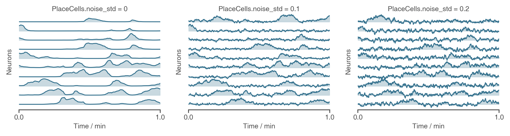

#### Spiking 
All neurons are rate based. However, at each update spikes are sampled as though neurons were Poisson neurons. These are stored in `Neurons.history['spikes']`. The max and min firing rates can be set with `Neurons.max_fr` and  `Neurons.min_fr`.
```
Neurons.plot_ratemap(spikes=True)
```


#### **Rate maps**
`PlaceCells`, `GridCells` and allocentric `BoundaryVectorCells` (among others) have firing rates which depend exclusively on the position of the agent. These rate maps can be displayed by querying their firing rate at an array of positions spanning the environment, then plotting. This process is done for you using the function `Neurons.plot_rate_map()`. 

More generally, however, cells firing is not only determined by position but potentially other factors (e.g. velocity, or historical effects if the layer is part of a recurrent network). In these cases the above method of plotting rate maps will necessarily fail. A more robust way to display the receptive field is to plot a heatmap of the positions of the Agent has visited where each positions contribution to a bin is weighted by the firing rate observed at that position. Over time, as coverage become complete, the firing fields become visible.
```
Neurons.plot_rate_map() #attempts to plot "ground truth" rate map 
Neurons.plot_rate_map(method="history") #plots rate map by firing-rate-weighted position heatmap
``` 

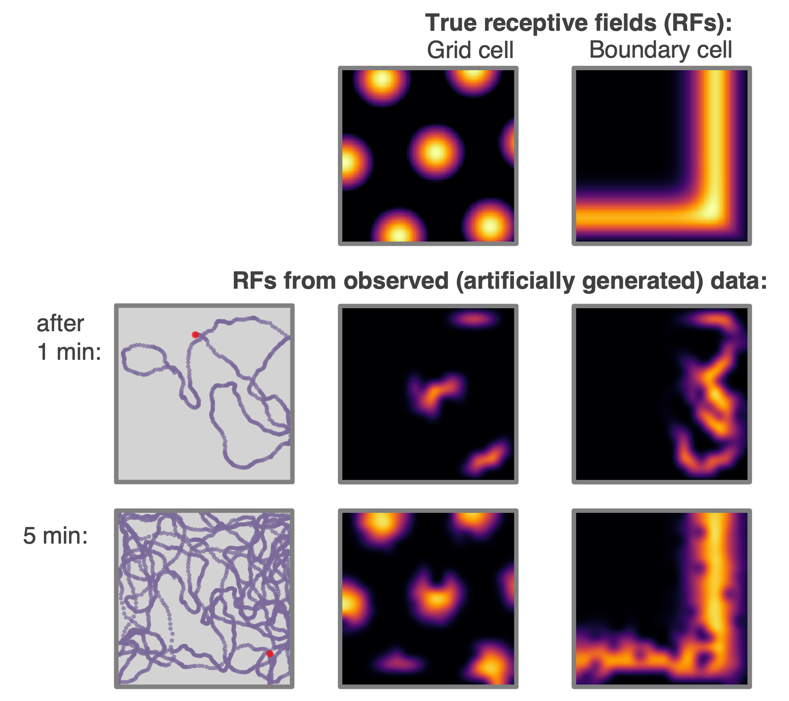


#### **Place cell models**

Place cells come in multiple types (given by `params['description']`), or it would be easy to write your own:
* `"gaussian"`: normal gaussian place cell 
* `"gaussian_threshold"`: gaussian thresholded at 1 sigma
* `"diff_of_gaussians"`: gaussian(sigma) - gaussian(1.5 sigma)
* `"top_hat"`: circular receptive field, max firing rate within, min firing rate otherwise
* `"one_hot"`: the closest place cell to any given location is established. This and only this cell fires. 

This last place cell type, `"one_hot"` is particularly useful as it essentially rediscretises space and tabularises the state space (gridworld again). This can be used to  contrast and compare learning algorithms acting over continuous vs discrete state spaces. This figure compares the 5 place cell models for population of 9 place cells (top left shows centres of place cells, and in all cases the `"widths"` parameters is set to  0.2 m, or irrelevant in the case of `"one_hot"`s)

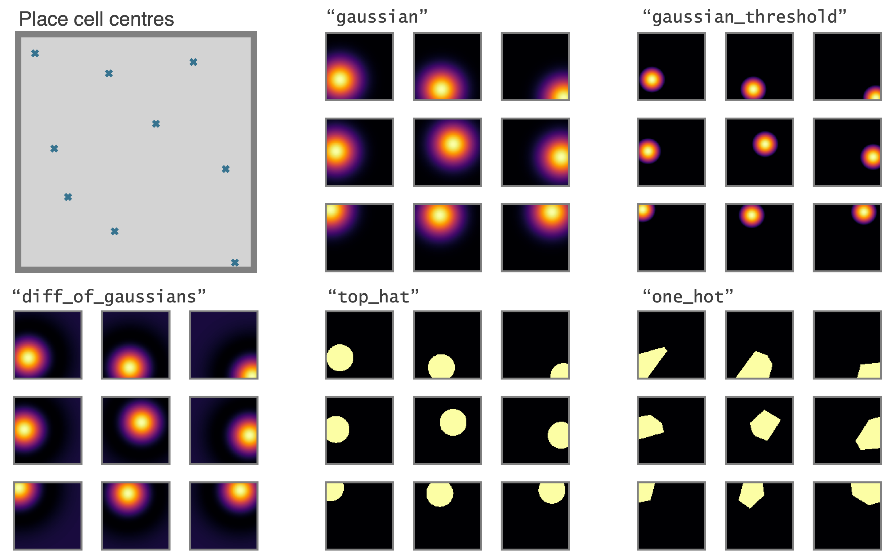

These place cells (with the exception of `"one_hot"`s) can all be made to phase precess by instead initialising them with the `PhasePrecessingPlaceCells()` class currently residing in the `contribs` folder. This figure shows example output data. 


#### **Geometry of `PlaceCells`** 
Choose how you want `PlaceCells` to interact with walls in the `Environment`. We provide three types of geometries.  

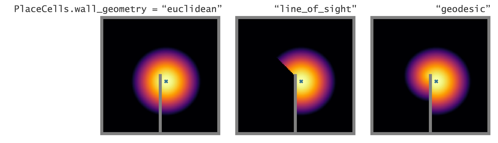

  
#### **Egocentric encodings**
Most `RatInABox` cell classes are allocentric (e.g. `PlaceCells`, `GridCells` etc. do not depend on the agents point of view) not egocentric. `BoundaryVectorCells` (BVCs) and `ObjectVectorCells` (OVCs) can be either. `FieldOfViewNeurons` exploit this by arranging sets of egocentric BVC or OVCs to tile to agents local field of view creating a comprehensive egocentric encoding of what boundaries or objects the agent can 'see' from it's current point of view. A custom plotting function displays the tiling and the firing rates as shown below. With an adequately defined field of view these can make, for example, "whisker cells". 

```python
FoV_BVCs = FieldOfViewBVCs(Ag)
FoV_OVCs = FieldOfViewOVCs(Ag)
BVCs_whiskers = FieldOfViewBVCs(Ag,params={
        "distance_range": [0.01, 0.2],  
        "angle_range": [
            75,
            105,
        ],  
        "spatial_resolution": 0.02,  # resolution of each OVC tiling FoV
        "cell_arrangement": "uniform_manifold",
        
})
```


#### **Reinforcement Learning and Successor Features**
A dedicated `Neurons` class called `SuccessorFeatures` learns the successor features for a given feature set under the current policy. See [this demo](./demos/successor_features_example.ipynb) for more info. 


`SuccessorFeatures` are a specific instance of a more general class of neurons called `ValueNeuron`s which learn value function for any reward density under the `Agent`s motion policy. This can be used to do reinforcement learning tasks such as finding rewards hidden behind walls etc as shown in [this demo](./demos/reinforcement_learning_example.ipynb). 

We also have a working examples of an actor critic algorithm using deep neural networks [here](./demos/actor_critic_example.ipynb)

Finally, we are working on a dedicated subpackage -- (`RATS`: RL Agent Toolkit and Simulator) -- to host all this RL stuff and more so keep  an eye out. 

#### **`Neurons` as function approximators**

Perhaps you want to generate really complex cell types (more complex than just `PlaceCells`, `GridCells` etc.). No problem. For this we provide two `Neurons` subclass useful for constructing complex Neuron types. For these classes instead of firing rates being determined explicitly by the state of the `Agent`, they recieve inputs from one or many other `RatInABox.Neurons` classes and pass these inputs through a function to calculate the firing rate.

* `FeedForwardLayer` linearly sums their inputs with a set of weights.
* `NeuralNetworkNeurons` are more general, they pass their inputs through a user-provided deep neural network (for this we use `pytorch`).

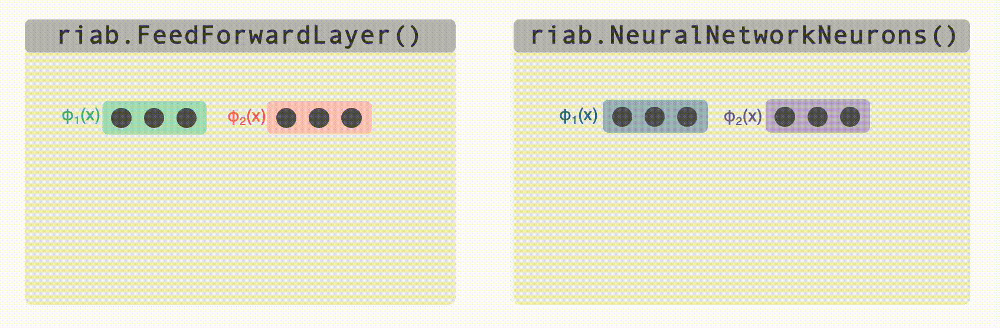


Both of these classes can be used as the building block for constructing complex multilayer networks of `Neurons` (e.g. `FeedForwardLayers` are `RatInABox.Neurons` in their own right so can be used as inputs to other `FeedForwardLayers`). Their parameters can be accessed and set (or "trained") to create neurons with complex receptive fields. In the case of `DeepNeuralNetwork` neurons the firing rate attached to the computational graph is stored so gradients can be taken. Examples can be found [here (deep learning with `NeuralNewtworkNeurons`)](./demos/deel_learning_example.ipynb) as well as [here (path integration)](./demos/path_integration_example.ipynb), [here (reinforcement learning)](./demos/reinforcement_learning_example.ipynb), [here (successor features)](./demos/successor_features_example.ipynb) and [here (actor critic deep RL)](./demos/actor_critic_example.ipynb). 


#### **Creating your own `Neuron` types**
We encourage users to create their own subclasses of `Neurons`. This is easy to do, see comments in the `Neurons` class within the [code](./ratinabox/Neurons.py) for explanation. By forming these classes from the parent `Neurons` class, the plotting and analysis features described above remain available to these bespoke Neuron types. 

### (iv) Figures and animations 
`RatInABox` is built to be highly visual. It is easy to plot or animate data and save these plots/animations. Here are some tips

#### **Saving**
* `ratinabox.figure_directory` a global variable specifying the directory into which figures/animations will be saved 
* `ratinabox.utils.save_figure(fig,fig_name)` saves a figure (or animation) into a dated folder within the figure directory  as both `".svg"` and `".png"` (`".mp4"` or `".gif"`). The current time will be appended to the `fig_name` so you won't ever overwrite. 


#### **Saving (but automatically)**
* Setting `ratinabox.autosave_plots = True` means RatInABox figure will be automatically saved in the figure directory without having to indvidually call the `utils` function above. 

#### **Styling**
* `ratinabox.stylize_plots()` this call sets some global matplotlib rcParams to make plots look pretty/exactly like they do in this repo


#### **Most important plotting functions**
The most important plotting functions are (see source code for the available arguments/kwargs):

```python
Environment.plot_environment() #visualises current environment with walls and objects
Agent.plot_trajectory() #plots trajectory
Agent.animate_trajectory() #animate trajectory
Neurons.plot_rate_map() # plots the rate map of the neurons at all positions
Neurons.plot_rate_timeseries() # plots activities of the neurons over time 
Neurons.animate_rate_timeseries() # animates the activity of the neurons over time 
```

Most plotting functions accept `fig` and `ax` as optional arguments and if passed will plot ontop of these. This can be used to make comolex or multipanel figures. For a comprehensive list of plotting functions see [here](./demos/list_of_plotting_fuctions.md). 

## Example Scripts
In the folder called [demos](./demos/) we provide numerous script and demos which will help when learning `RatInABox`. In approximate order of complexity, these include:
* [simple_example.ipynb](./demos/simple_example.ipynb): a very simple tutorial for importing RiaB, initialising an Environment, Agent and some PlaceCells, running a brief simulation and outputting some data. Code copied here for convenience.
```python 
import ratinabox #IMPORT 
from ratinabox.Environment import Environment
from ratinabox.Agent import Agent
from ratinabox.Neurons import *
#INITIALISE CLASSES
Env = Environment() 
Ag = Agent(Env)
PCs = PlaceCells(Ag)
#EXPLORE
for i in range(int(20/Ag.dt)): 
    Ag.update()
    PCs.update()
#ANALYSE/PLOT
print(Ag.history['pos'][:10]) 
print(PCs.history['firingrate'][:10])
fig, ax = Ag.plot_trajectory()
fig, ax = PCs.plot_rate_timeseries()
```
* [extensive_example.ipynb](./demos/extensive_example.ipynb): a more involved tutorial. More complex enivornment, more complex cell types and more complex plots are used. 
* [list_of_plotting_functions.md](./demos/list_of_plotting_fuctions.md): All the types of plots available for are listed and explained. 
* [readme_figures.ipynb](./demos/readme_figures.ipynb): (Almost) all plots/animations shown in the root readme are produced from this script (plus some minor formatting done afterwards in powerpoint).
* [paper_figures.ipynb](./demos/paper_figures.ipynb): (Almost) all plots/animations shown in the paper are produced from this script (plus some major formatting done afterwards in powerpoint).
* [decoding_position_example.ipynb](./demos/decoding_position_example.ipynb): Postion is decoded from neural data generated with RatInABox. Place cells, grid cell and boundary vector cells are compared.
* [conjunctive_gridcells_example.ipynb](./demos/conjunctive_gridcells_example.ipynb): `GridCells` and `HeadDirectionCells` are minimally combined useing `FeedForwardLayer` to create head-direction-selective grid cells (aka. conjunctive cells).
* [splitter_cells_example.ipynb](./demos/splitter_cells_example.ipynb): A simple simultaion demonstrating how `Splittre` cell data could be create in a figure-8 maze.
* [deep_learning_example.ipynb](./deep_learning_example.ipynb): Here we showcase `NeuralNetworkNeurons` a class of `Neurons` which has a small neural network embedded inside. We train them to take grid cells as inputs and output an arbitrary function  as their rate map.
* [reinforcement_learning_example.ipynb](./demos/reinforcement_learning_example.ipynb): RatInABox is use to construct, train and visualise a small two-layer network capable of model free reinforcement learning in order to find a reward hidden behind a wall. 
* [actor_critic_example.ipynb](./demos/actor_critic_example.ipynb): RatInABox is use to implement the actor critic algorithm using deep neural networks.
* [successor_features_example.ipynb](./successor_features_example.ipynb): RatInABox is use to learn and visualise successor features under random and biased motion policies.
* [path_integration_example.ipynb](./demos/path_integration_example.ipynb): RatInABox is use to construct, train and visualise a large multi-layer network capable of learning a "ring attractor" capable of path integrating a position estimate using only velocity inputs.

## Contribute [](https://github.com/RatInABox-Lab/RatInABox/graphs/contributors) [](https://github.com/RatInABox-Lab/RatInABox/graphs/issues-closed) [](https://github.com/RatInABox-Lab/RatInABox/pulls) [](https://github.com/RatInABox-Lab/RatInABox/graphs/commit-activity)
`RatInABox` is open source project and we actively encourage  all contributions from example bug fixes to documentation or new cell types. Feel free to make a pull request (you will need to fork the repository first) or raise and issue. 

We have a dedicated [contribs](./ratinabox/contribs/) directory where you can safely add awesome scripts and new `Neurons` classes etc.

Questions? Just ask! Ideally via opening an issue so others can see the answer too. 

Thanks to all contributors so far:


## Cite 

If you use `RatInABox` in your research or educational material, please cite the work as follows: 

Bibtex:
```
@article{George2024,
  title = {RatInABox,  a toolkit for modelling locomotion and neuronal activity in continuous environments},
  volume = {13},
  ISSN = {2050-084X},
  url = {http://dx.doi.org/10.7554/eLife.85274},
  DOI = {10.7554/elife.85274},
  journal = {eLife},
  publisher = {eLife Sciences Publications,  Ltd},
  author = {George,  Tom M and Rastogi,  Mehul and de Cothi,  William and Clopath,  Claudia and Stachenfeld,  Kimberly and Barry,  Caswell},
  year = {2024},
  month = feb 
}
```

Formatted:
```
Tom M George, Mehul Rastogi, William de Cothi, Claudia Clopath, Kimberly Stachenfeld, Caswell Barry. "RatInABox, a toolkit for modelling locomotion and neuronal activity in continuous environments" (2024), eLife, https://doi.org/10.7554/eLife.85274 .
``` 
The research paper corresponding to the above citation can be found [here](https://elifesciences.org/articles/85274).


