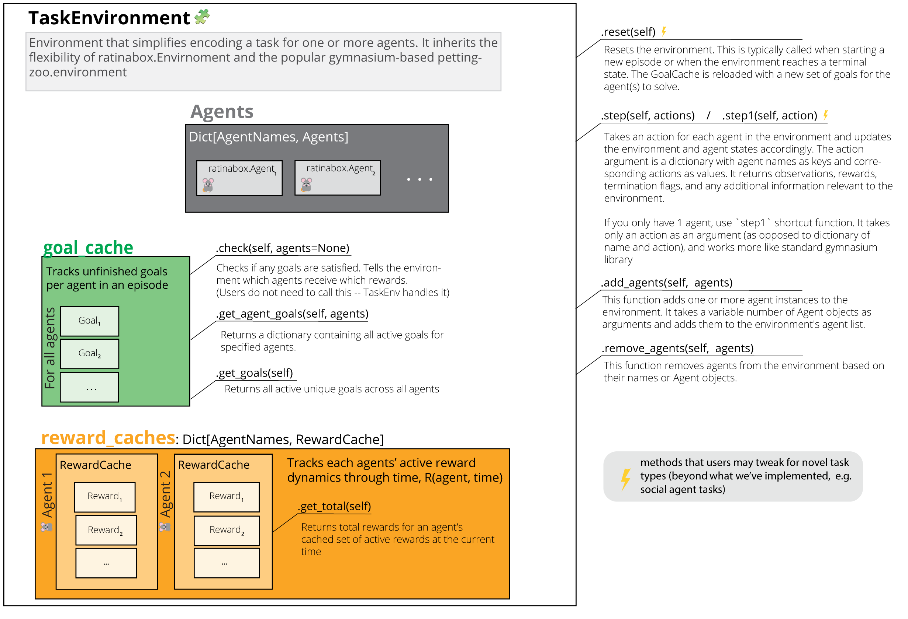
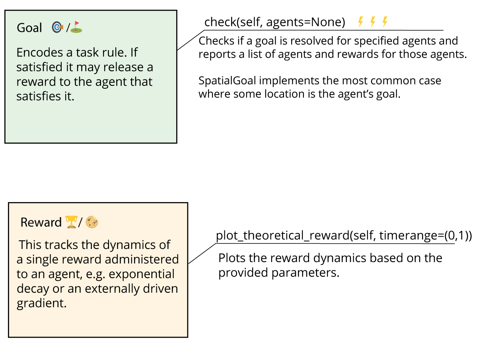

# TaskEnvironment

The TaskEnvironment is a utility designed to streamline the creation and management of environments that host various tasks. It is a combination of the flexible ratinabox.Environment and the widely-used pettingzoo.env, a multi-agent reinforcement learning environment.

This system includes tools to manage Goals and Rewards, but these are not mandatory. If desired, a TaskEnvironment can be written or inherited in a similar fashion to a pure pettingzoo-compatible RIB Environment.

In this section, we will explore some of the offerings of TaskEnvironment.py. Here, you'll find descriptions of customizable structures that can handle an environment filled with diverse types of goals and rewards.

The primary classes in TaskEnvironment.py include:

* Goal: An abstract class representing a goal that agents must acheive in a task. For new tasks, users may need to create their own unique goal classes derived from Goal. These custom classes would define specific methods to verify goal satisfaction and manage any other specialized behaviors.

* Reward: This class represents a reward that agents can obtain by accomplishing goals. Rewards can possess dynamics that change over time, such as decay rates, or they may be influenced by an external ramping signal.

* RewardCache: This class serves as a cache for all active rewards associated with an agent. It maintains a record of the rewards and offers methods to update and fetch the total value of active rewards.

* GoalCache: This class oversees all active goals across all agents. It is in charge of monitoring goal achievement and coordinating agent interactions with the goals.

* TaskEnvironment: This acts as the foundational class for task environments. It establishes the core structure, methods, and functionalities for handling agents, rewards, and goals.

## Overview

This section provides a high-level summary of how the classes mentioned above interact to fulfill your task requirements. Primarily, we focus on the most critical objects and methods. For more detailed information, refer to the documentation associated with each class.

The `TaskEnvironment` includes an `Agents` dictionary that maps `agent_name` to `agent`, effectively indexing the agents. New agents can be added with the `add_agents()` method. The `step(actions)` method steps the agents through your environment, transmitting `actions` to each agent. Depending on the agent actions, the environment can adapt and dispense rewards if a goal is met.

For goal tracking, we optionally utilize a `GoalCache` object that stores the set of goals (or sequences of goals) for the agents. The `RewardCache` contains the active rewards for each agent. When a `Goal` is fulfilled by an agent (for example, when an animal reaches a specific location), it adds a goal to that animal's cache. These objects can dispense rewards over time to the agent after the initiation of a particular event.

The `Goals` within the `GoalCache` specify the rules – the conditions under which your agent receives a reward. The `Reward` objects in the `RewardCache` detail the dynamics of your reward.

**Note:** The `Goal`/`GoalCache` and `Reward`/`RewardCache` systems are optional. These interfaces serve as helper tools to organize and sequence goals, and to monitor non-sparse rewards. If you prefer, you can bypass these interfaces. You're welcome to inherit the `TaskEnvironment` directly if you only want a `gym`/`pettingzoo` RIB `Environment` without these additional features. You can manually incorporate your rules and reward logic into the `.step()` function. Please refer to the function and its documentation to understand the expected output.

## Creating your own task, examples

### `Reward`/`Goal` interfaces
(coming soon...)
### Without `Reward`/`Goal` interfaces, like a raw RIB environment + pettingzoo
(coming soon...)

<!--
## Detailed documentation

### Task Environment
"TaskEnvironment" is a class that inherits from both "Environment" and
"pettingzoo.ParallelEnv" . This class represents an environment that has a task structure, where
there is a goal, and when the goal is reached, the environment terminates the current episode
and starts a new one. The environment can be static or dynamic, depending on whether the
"update()" method is implemented. The class also supports rendering using matplotlib. 

The "TaskEnvironment" class has several attributes, including:
* "Agents" : A dictionary of agents in the environment.
* "goal_cache" : A "GoalCache" object that stores the current goals for each agent.
* "t" : The current time.
* "dt" : The time step.
* "history" : A dictionary that stores the history of the environment.
* "render_every" : How often the environment should be rendered (in time steps).
* "verbose" : A boolean indicating whether to print information about the environment.
* "render_mode" : The mode for rendering the environment (matplotlib, pygame, or none).
* "_stable_render_objects" : A dictionary that stores objects that are stable across a rendering
type.
* "teleport_on_reset" : A boolean indicating whether to teleport agents to random locations on
reset.
* "save_expired_rewards" : A boolean indicating whether to save expired rewards.
* "observation_spaces" : A dictionary of observation spaces for each agent.
* "action_spaces" : A dictionary of action spaces for each agent.
* "reward_caches" : A dictionary of reward caches for each agent.
* "agent_names" : A list of agent names.
* "agents" : A list of agent names for agents who are still active in an episode.
* "info" : A dictionary containing information about the environment.
* "dynamic_walls" : A list of walls that can change or move (Not implemented)
* "dynamic_objects" : A list of objects that can move (Not implemented)

The class has several methods, such as "observation_space()" , "action_space()" ,
"add_agents()" , "remove_agents()" , "_agentnames()" , "_dict()" , "_is_terminal_state()" ,
"_is_truncated_state()" , "reset()" , "update()" , "step()" , "step1()" , "get_observation()" , and
"get_reward()" .

These methods handle various tasks such as adding and removing agents, checking terminal
and truncated states, resetting and updating the environment, taking a step in the environment,
and getting the current observation and reward.

