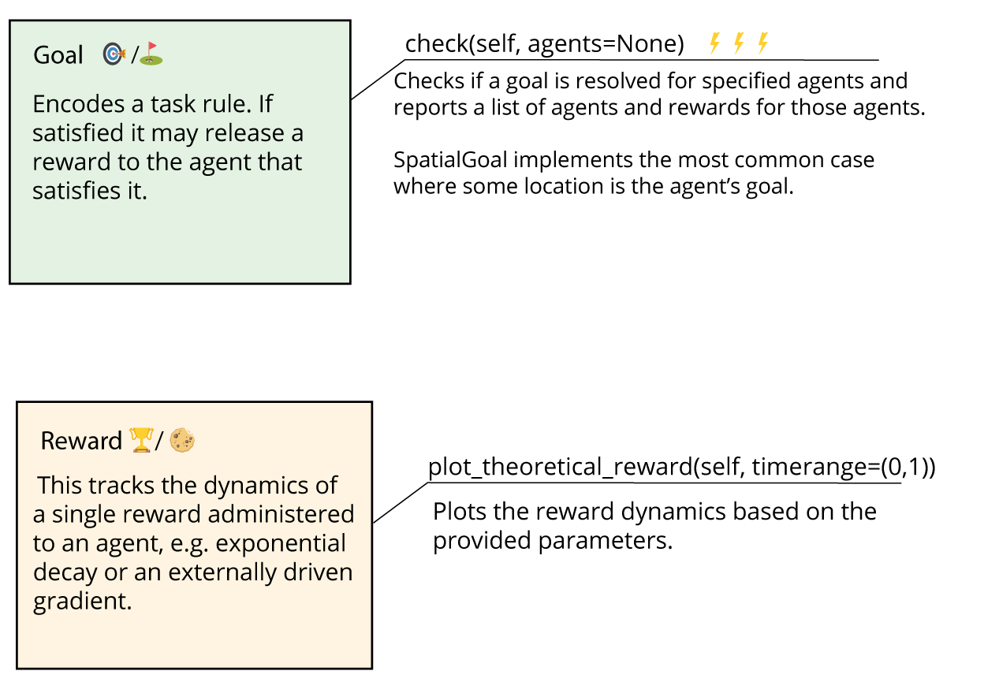

# TaskEnvironment

`TaskEnvironment` is designed to simplify creating and managing environments that contain tasks! This blends the flexble `ratinabox.Environment` with a popular multi-agent reinforcement learning `pettingzoo.env` environment. Included are some tools to manage `Goal`s and `Reward`s, but they are optional. You could write/inherit a `TaskEnvironment` like a purely `pettingzoo` enabled RIB `Environment`.

Let's exame some things `TaskEnvironment.py` offers. These are some basic descriptions of customizable structures to handle an environment with various types of goals and rewards.

The main classes in TaskEnvironment.py are:

* `Goal`: This abstract class represents a goal that agents need to achieve. For new tasks, users may need to implement their own specialized goal classes derived from Goal by defining specific methods to determine goal satisfaction and any other specific behaviors.

* `Reward`: This class represents a reward that agents can earn by satisfying goals. Rewards can have dynamics that evolve over time (e.g. decay rates or may be driven by an external ramping signal).

* `RewardCache`: This class acts as a cache for all active rewards attached to an agent. It keeps track of the rewards and provides methods to update and retrieve the total value of active rewards.

* `GoalCache`: This class manages all active goals across all agents. It is responsible for tracking goal completion and coordinating agent interactions with the goals.

* `TaskEnvironment`: This serves as the base class for task environments. It defines the core structure, methods, and functionalities for managing agents, rewards, and goals.

## Overview

The following figures offer a birds-eye summary of how the above classes interact to carry out your task of interest.  We're mainly showing the most important objects and methods. See the class docfiles for more info.

Task Environment contains an `Agents` dictionary `agent_name -> agent`, names indexing the agents. You can add agents with `add_agents()` method. `step(actions)` moves the agents through your environment, sending `actions` to each agent, and the environment can change with agent actions, emitting rewards if a goal is reached.

To track goals, we optionally have a `GoalCache` object that stores the set of goals (or goal sequences) for the agents. 

The `RewardCache` holds the active rewards for each agent. When a `Goal` is satisfied by one of the agents, say an animal reaches a special location, it releases a goal to that animal's cache. These are objects that can release reward over time to the agent after triggering the event.

`Goals` inside the `GoalCache` encode the rules --- what conditions should your agent get a reward. `Reward` objects in the `RewardCache` encode the dynamics of your reward.

### :angel: 👉 `Goal`/`GoalCache` and `Reward`/`RewardCache` are ❗️OPTIONAL  ❗️
The goal and reward interfaces are optional helpers to keep organize goals and sequence them, and rewards interfaces help track non-sparse rewards. You can skip/leap-frog these! 

Feel free to simply inherit the `TaskEnvironment` if you merely want a `gynasium`/`pettingzoo` RIB `Environment` without the helpful but extra fluff. You can manually encode your rules and reward logic pythonically into the `.step()` function. See the function and its attached doc file to understand what you should output.

## Creating your own task, examples

### `Reward`/`Goal` interfaces
(coming soon...)
### Without `Reward`/`Goal` interfaces, like a raw RIB environment + pettingzoo
(coming soon...)

<!--
## Detailed documentation

### Task Environment
"TaskEnvironment" is a class that inherits from both "Environment" and
"pettingzoo.ParallelEnv" . This class represents an environment that has a task structure, where
there is a goal, and when the goal is reached, the environment terminates the current episode
and starts a new one. The environment can be static or dynamic, depending on whether the
"update()" method is implemented. The class also supports rendering using matplotlib. 

The "TaskEnvironment" class has several attributes, including:
* "Agents" : A dictionary of agents in the environment.
* "goal_cache" : A "GoalCache" object that stores the current goals for each agent.
* "t" : The current time.
* "dt" : The time step.
* "history" : A dictionary that stores the history of the environment.
* "render_every" : How often the environment should be rendered (in time steps).
* "verbose" : A boolean indicating whether to print information about the environment.
* "render_mode" : The mode for rendering the environment (matplotlib, pygame, or none).
* "_stable_render_objects" : A dictionary that stores objects that are stable across a rendering
type.
* "teleport_on_reset" : A boolean indicating whether to teleport agents to random locations on
reset.
* "save_expired_rewards" : A boolean indicating whether to save expired rewards.
* "observation_spaces" : A dictionary of observation spaces for each agent.
* "action_spaces" : A dictionary of action spaces for each agent.
* "reward_caches" : A dictionary of reward caches for each agent.
* "agent_names" : A list of agent names.
* "agents" : A list of agent names for agents who are still active in an episode.
* "info" : A dictionary containing information about the environment.
* "dynamic_walls" : A list of walls that can change or move (Not implemented)
* "dynamic_objects" : A list of objects that can move (Not implemented)

The class has several methods, such as "observation_space()" , "action_space()" ,
"add_agents()" , "remove_agents()" , "_agentnames()" , "_dict()" , "_is_terminal_state()" ,
"_is_truncated_state()" , "reset()" , "update()" , "step()" , "step1()" , "get_observation()" , and
"get_reward()" .

These methods handle various tasks such as adding and removing agents, checking terminal
and truncated states, resetting and updating the environment, taking a step in the environment,
and getting the current observation and reward.

