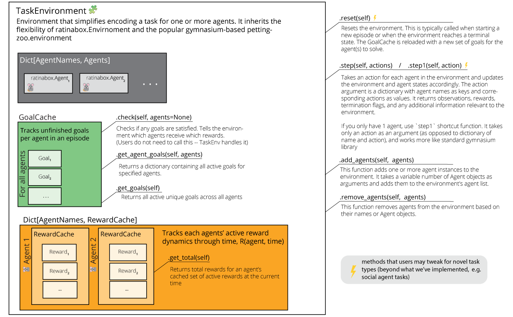
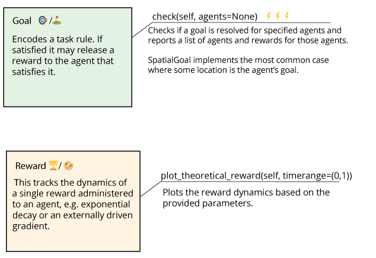

# TaskEnvironment

`TaskEnvironment` is designed to simplify specification and management of tasks that agents carry out, blending the flexble `ratinabox.Environment` with a popular multi-agent reinforcement learning `pettingzoo.env` environment. 

`TaskEnvironment` offers customizable environment structure that can handle various types of goals, rewards, and agent interactions. 

The main classes in TaskEnvironment.py are:

* `Goal`: This abstract class represents a goal that agents need to achieve. For new tasks, users may need to implement their own specialized goal classes derived from Goal by defining specific methods to determine goal satisfaction and any other specific behaviors.

* `Reward`: This class represents a reward that agents can earn by satisfying goals. Rewards can have dynamics that evolve over time (e.g. decay rates or may be driven by an external ramping signal).

* `RewardCache`: This class acts as a cache for all active rewards attached to an agent. It keeps track of the rewards and provides methods to update and retrieve the total value of active rewards.

* `GoalCache`: This class manages all active goals across all agents. It is responsible for tracking goal completion and coordinating agent interactions with the goals.

* `TaskEnvironment`: This serves as the base class for task environments. It defines the core structure, methods, and functionalities for managing agents, rewards, and goals.

## Overview

The following figures summarize and depict how the classes are related and a low-resolution overview of a few methods users may find useful. (For complete method description, consult the [detailed documentation](#Detailed-documentation) section.

## `SpatialGoalEnvironment`, a specific instance of `TaskEnvironment`

## Creating your own Task

Easiest way to encode your task would be to 
1. write your rule(s) into a `Goal` object(s): you can combine existing objects with custom objects. If the agent has to do three things in a sequence, one `Goal` per item.
2. decide the `Reward` to attach to the goal
3. overload reset() to push your Goal objects of interest into the env.goalcache when an episode begins.

|:eyes: NOTE, If you would like something more light-weight, you can also side-step creating a `Goal` class entirely, and overload `step()` to check for whatever your task condition is, and push a `Reward` to appropriate agents.|
---

## Example

<!--
## Detailed documentation

### Task Environment
"TaskEnvironment" is a class that inherits from both "Environment" and
"pettingzoo.ParallelEnv" . This class represents an environment that has a task structure, where
there is a goal, and when the goal is reached, the environment terminates the current episode
and starts a new one. The environment can be static or dynamic, depending on whether the
"update()" method is implemented. The class also supports rendering using matplotlib. 

The "TaskEnvironment" class has several attributes, including:
* "Agents" : A dictionary of agents in the environment.
* "goal_cache" : A "GoalCache" object that stores the current goals for each agent.
* "t" : The current time.
* "dt" : The time step.
* "history" : A dictionary that stores the history of the environment.
* "render_every" : How often the environment should be rendered (in time steps).
* "verbose" : A boolean indicating whether to print information about the environment.
* "render_mode" : The mode for rendering the environment (matplotlib, pygame, or none).
* "_stable_render_objects" : A dictionary that stores objects that are stable across a rendering
type.
* "teleport_on_reset" : A boolean indicating whether to teleport agents to random locations on
reset.
* "save_expired_rewards" : A boolean indicating whether to save expired rewards.
* "observation_spaces" : A dictionary of observation spaces for each agent.
* "action_spaces" : A dictionary of action spaces for each agent.
* "reward_caches" : A dictionary of reward caches for each agent.
* "agent_names" : A list of agent names.
* "agents" : A list of agent names for agents who are still active in an episode.
* "info" : A dictionary containing information about the environment.
* "dynamic_walls" : A list of walls that can change or move (Not implemented)
* "dynamic_objects" : A list of objects that can move (Not implemented)

The class has several methods, such as "observation_space()" , "action_space()" ,
"add_agents()" , "remove_agents()" , "_agentnames()" , "_dict()" , "_is_terminal_state()" ,
"_is_truncated_state()" , "reset()" , "update()" , "step()" , "step1()" , "get_observation()" , and
"get_reward()" .

These methods handle various tasks such as adding and removing agents, checking terminal
and truncated states, resetting and updating the environment, taking a step in the environment,
and getting the current observation and reward.

