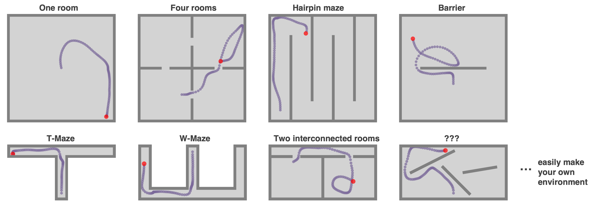
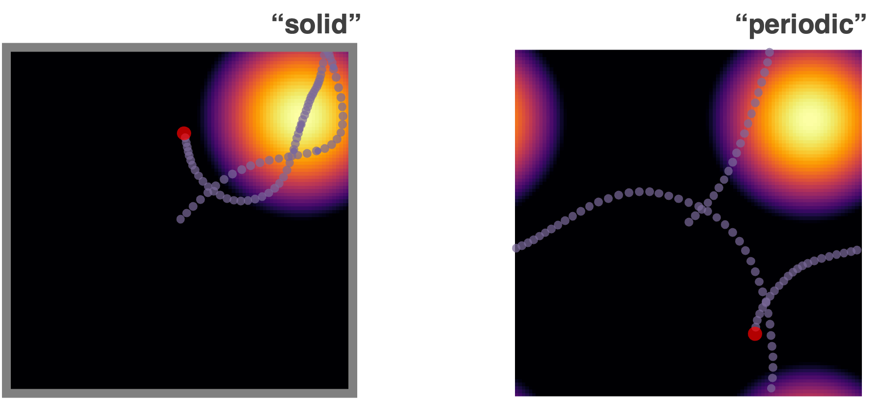
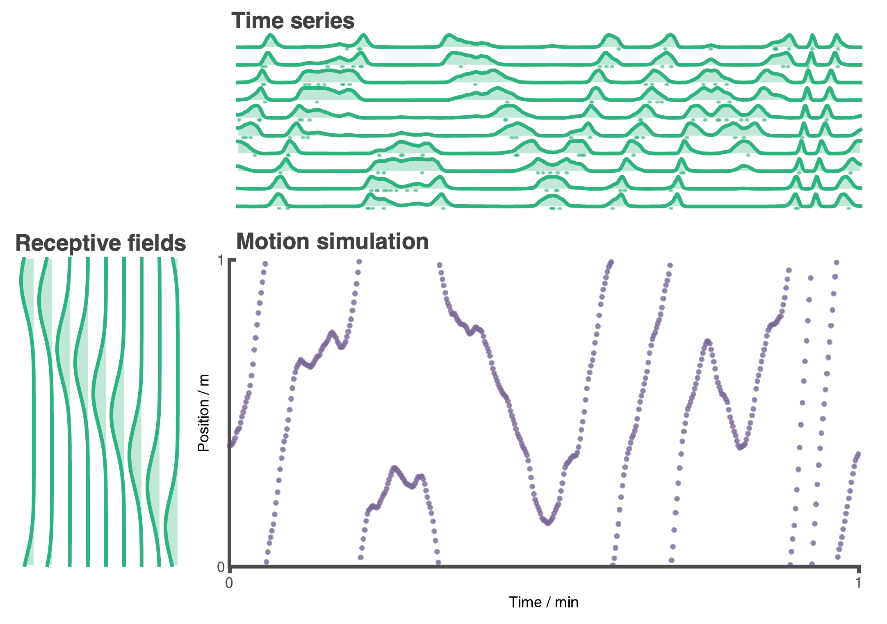
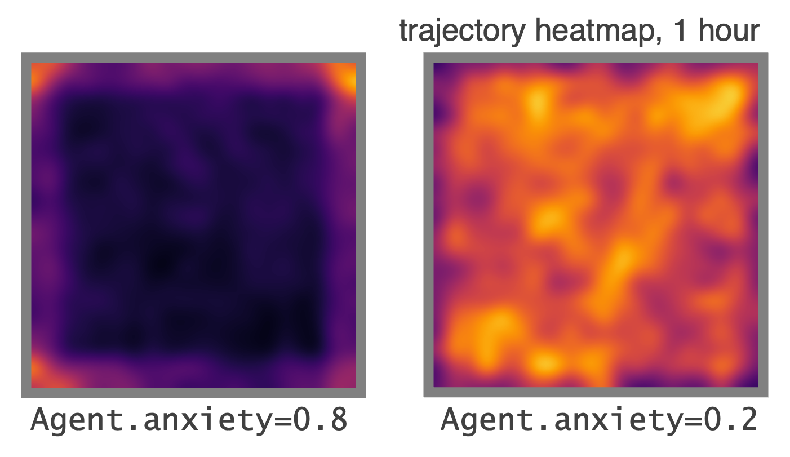
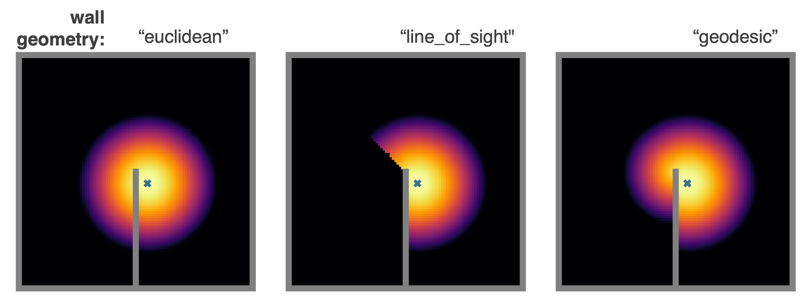

# RatInABox 🐀📦


RatInABox is a toolkit for simulating spatial navigation and/or hippocampal-entorhinal cell types. RatInABox represents a clean departure from pre-discretised "gridworld". Position and neuronal firing rates are calculated online with float precision. With it you can:

* Generate pseudo-realistic trajectories for rats exploring 1 and 2D environments
* Simulate spatially selective cells found in the Hippocampal-Entorhinal system (place cells, grid cells, boundary vector cells and velocity cells). 

`RatInABox` contains three classes: 

1. `Environment()`: The environment/maze that the agent lives in. 1- or 2-dimensional.
2. `Agent()`: The agent (or "rat") moving around the Environment. 
3. `Neurons()`: A population of neurons with firing rates determined by the state of the Agent. 

The top animation shows the kind of simulation you can easily run using this toolbox. It shows an agent randomly exploring a 2D environment with a wall. Four populations of cells (place cells, grid cells, boundary vector cells and velocity cells) vary their activity and "fire" as the agent explores.

## Key features

* **Flexible**: Generate arbitrarily complex environments. 
* **Biological**: Simulate large populations of spatially modulated cell type (place cells, grid cells, boundary vector cells, velocity cells). Use cells in rate based or spiking models. 
* **Fast**: Simulating 1 minute exploration in a 2D environment with 100 place cells (dt=10 ms) take just 2 seconds on a laptop (no GPU needed).
* **Precise**: No more pre-discretised positions, tabular state spaces, or jerky movement policies. It's all continuous. 
* **Visual** Plot or animate trajectories, firing rate timeseries', spike rasters, receptive fields, heat maps and more using the plotting functions. 
* **Easy**: Sensible default parameters mean you can have realisitic simulation data to work with in ~10 lines of code.


## Get started 
At the bottom of this readme we provide Example scripts: one simple and one extensive. Reading through this section should be enough to get started. 

## Requirements
* Python 3.7+
* NumPy
* Scipy
* Matplotlib
* Jupyter (optional)

## Installation 
I will sort this soon. For now just clone the directory.

## Feature run-down
Here is a list of features loosely organised into three categories: those pertaining to (i) the Environment, (ii) the Agent and (iii) the Neurons. 

### (i) `Environment()` features
#### Walls 
Arbitrarily add walls to the environment to replicate any desired maze structure using command:
```python 
Environment.add_wall([[0.3,0.0],[0.3,0.5]])
```
Here are some easy to make examples.


#### Boundary conditions 
Boundary conditions can be "periodic" or "solid". Place cells and the Agent will respect boundaries accordingly. 
```python
Env = Environment(
    params = {'boundary_conditions':'periodic'} #or 'solid' (default)
) 
```

#### 1- or 2-dimensions 
Almost all features work in both 1 and 2 dimensions. The following figure shows 1 min of exploration of an agent in a 1D environment with periodic boundary conditions spanned by 10 place cells. 
```python 
Env = Environment(
    params = {'dimensionality':'1D'} #or '2D' (default)
) 
```



### (ii) `Agent()` features
#### Wall repelling 
Walls in the environment mildly "repel" the agent. Coupled with the finite turning speed this creates, somewhat counterintuitively, an effect where the agent is biased to over-explore near walls and corners (as shown in these heatmaps) matching real rodent behaviour. It can also be turned off.
```python 
Αgent.walls_repel = True #False
```


#### Random motion model
Motion is stochastic but smooth. The speed (and rotational speed if in 2D) of an Agent take constrained random walks governed by Ornstein-Uhlenbeck processes. You can change the variance and coherence times of these processes to control the shape of the trajectory.

```python
Agent.speed_mean = 0.2
Agent.speed_std = 0.1
Agent.speed_coherence_time = 3
Agent.rotation_velocity_std = 0.1
Agent.rotational_velocity_coherence_time = 3
```
The following set of trajectories were generated by modifying the rotational_velocity_std


#### Policy control 
By default the movement policy is an uncontrolled (e.g. displayed above). It is possible, however, to manually pass a "drift_velocity" to the Agent on each `update()` step. The agent velocity will drift towards drift velocity. We envisage this being use, for example, by an Actor-Critic system to control the Agent. The actor-critic system could take as input the firing rate of some Neurons(). As a demonstartion that this method can be used to control the agent's movement here we set a radial drift velocity to encourage circular motion.   
```
Agent.update(drift_velocity=drift_velocity)
```


### (iii) `Neuron()` features 

#### Multiple cell types: 
Currently supported cell types (`params['cell_class']`)  are: 
* `"place_cell"`
* `"grid_cell"`: rectified sum of three cosine plane waves
* `"boundary_vector_cell"`: double exponential model matching de Cothi and Barry (2020)
* `"velocity_cell"`: cells encode positive and negative x and y velocitys (2N cells in N-dimensions)

Place cells come in multiple types (give by `params['description']`):
* `"gaussian"`: normal gaussian place cell 
* `"gaussian_threshold"`: gaussian thresholded at 1 sigma
* `"diff_of_gaussian"`: gaussian(sigma) - gaussian(1.5 sigma)
* `"top_hat"`: circular receptive field, max firing rate within, min firing rate otherwise
* `"one_hot"`: the closest palce cell to any given location is established. This and only this cell fires. 

This last place cell type, `"one_hot"` is prticularly useful as it essentially rediscretises space and tabularises the state space (gridworld again). This can be used to effortlessly contrast and compare learning algorithms acting over continuous vs discrete state spaces. 

#### Geometry
Choose how you want place cells to interact with walls in the environment. We provide three types of geometries. `'geodesic'` calculates the shortest possible walk (obeying walls and boundary conditions) to a place cells centre. 


#### Spiking 
All neurons are rate based. Concurrently spikes are sampled at each time step as though neurons were Poisson neurons. These are stored in `Neurons.history['spikes']`. The max and min firing rates can be set with `Neurons.max_fr` and  `Neurons.min_fr`.
```
Neurons.plot_rate_timeseries(spikes=True)
Neurons.plot_ratemap(spikes=True)
```


#### Rate maps 
Place cells, grid cells and boundary vector cells have analytic receptive fields. These can be displayed by querying their firing rate at an array of positions spanning the environment, then plotting. 

An alternative, and ultimately more robust way to display the receptive field is to plot a heatmap of the positions of the Agent has visited where each positions contribution to a bin is weighted by the firing rate observed at that position. Over time, as coverage become complete, the firing fields become visible.  Velocity neurons provide an interesting  example; they have no predefined/analytic "receptive field" but the firing-rate-weighted position heatmap is still well defined and can be plotted. The velocity neuron shown (v_x^+) is most active near the north and south boundaries where the agent rushes along. 
```
Neurons.plot_rate_map() #attempted to plot analytic rate map 
Neurons.plot_rate_map(by_history=True) #plots rate map by firing-rate-weighted position heatmap
``` 


#### More complex Neuron types
We encourage more complex Neuron classes to be made with the `Neuron()` class as parent. Specifically by writing your own `update()` and `get_state()` you can create more complex neuron types. For example  you could write a `Neuron()` class to fire as a weighted sum inputs from another neuronal layers (for example George and de Cothi et al. (2022)). Or maybe implement a recurrent layer feeding into itself. By saving `firingrate` into `Neuron.history` at each step plotting functions shown here should still be functional for downstream analysis.

## Contribute 
RatInABox is an open source project, and we actively encourage community contributions. These can take various forms, such as new movement policies, new cells types, new geometries, bug fixes, documentation, citations of relevant work, or additional experiment notebooks. If there is a small contribution you would like to make, please feel free to open a pull request, and we can review it. If there is a larger contribution you are considering, please open a github issue. This way, the contribution can be discussed, and potential support can be provided if needed. 

## Example Scripts

### Simple example
Initialise a 2D environment. Initialise an agent in the environment. Initialise some place cells. Simulate for 10 seconds. Print table of times, position and firing rates. 

```python
Env = Environment()
Ag = Agent(params={'Environment':Env})
PlaceCells = Neurons(params={'Agent':Ag,
                             'cell_class':'place_cells'})

for i in range(int(60/Ag.dt)):
    Ag.update()
    PlaceCells.update()

print(Ag.history['t'])
print(Ag.history['pos'])
print(PlaceCells.history['firingrates'])
```

### Extensive example
In this example we go a bit further. 
1. Initialise environment. A rectangular environment of size 2 x 1 meters. 
2. Add walls. Dividing the environment into two equal rooms. 
3. Add Agent. Place the Agent at coordinates (0.5,0.5). Set the speed of the agent to be 20+-5 cm/s.
4. Add place cells. 100 Gaussian threshold place cells. Set the radius to 40 cm. Set their wall geometry to "line_of_sight". Set the location of the 100th place cells to be near the middle of the doorway at coordinates(1.1,0.5). Set the max firing rate of these place cells to 3 Hz and the min firing rate (e.g. baseline) of 0.1 Hz. 
5. Add boundary vector cells. 30 of them. 
6. Simulate. For 10 minutes of random motio with a timestep of dt=10 ms. 
7. Plot trajectory. Plot final 30 seconds from t=4min30 to t=5mins seconds overlayed onto a heatmap of the trajectory over the full period. 
8. Plot timeseries. For 12 randomly chosen boundary vector cells. From t_start = 0 s to t_end = 60 s. Include spikes. 
9. Plot place cells. Show a scatter plot of the centres of the place cells. 
10. Plot rate maps. For 3 randomly chosen place cells. Then, below this, plot a rate map of the same 5 place cells but as calculated using the firing-rate-weighted position historgram. Include spikes on the latter rate maps. 

Despite the complexity of the above simulation it requires only ~40 lines of code and takes ~1.5 minutes to run on a laptop (or just 5 seconds whith dt=200 ms, which is still stable).

``` python 
# 1 Initialise environment.
Env = Environment(
    params = {'aspect':2,
               'scale':1})

# 2 Add walls. 
Env.add_wall([[1,0],[1,0.35]])
Env.add_wall([[1,0.65],[1,1]])

# 3 Add Agent.
Ag = Agent(
    params={'Environment':Env,})
Ag.pos = np.array([0.5,0.5])
Ag.speed_mean = 0.2
Ag.speed_std = 0.05

# 4 Add place cells. 
PCs = Neurons(
    params={'Agent':Ag,
            'cell_class':'place_cell',
            'n':100,
            'description':'gaussian_threshold',
            'widths':0.40,
            'wall_geometry':'line_of_sight',
            'max_fr':5,
            'min_fr':0.1})
PCs.place_cell_centres[99] = np.array([1.1,0.5])

# 5 Add boundary vector cells.
BVCs = Neurons(
    params = {'Agent':Ag,
              'cell_class':'boundary_vector_cell',
              'n':30,})

# 6 Simulate. 
dt = 10e-3 
T = 10*60
from tqdm import tqdm #gives time bar
for i in tqdm(range(int(T/dt))):
    Ag.update(dt=dt)
    PCs.update()
    BVCs.update()

# 7 Plot trajectory. 
fig, ax = Ag.plot_position_heatmap()
fig, ax = Ag.plot_trajectory(t_start=570,t_end=600,fig=fig,ax=ax)

# 8 Plot timeseries. 
BVCs.plot_rate_timeseries(t_start=0,t_end=60,chosen_neurons='12',plot_spikes=True)

# 9 Plot place cells. 
PCs.plot_place_cell_locations()

# 10 Plot rate maps. 
PCs.plot_rate_map(chosen_neurons='3',plot_spikes=False)
PCs.plot_rate_map(chosen_neurons='3',by_history=True,plot_spikes=True)
```
The figures output by this script look like:

