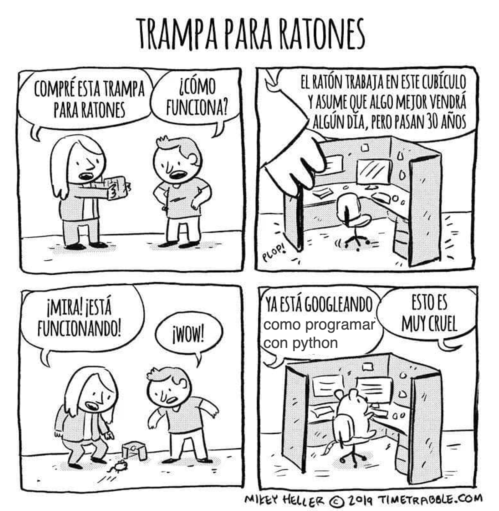

<!--  -->


# 🐀 RatInABox 📦

`RatInABox` (paper here) is a toolkit for simulating motion and various spatially or velocity-modulated cell types found in the Hippocampla formation. `RatInABox` is fully continuous is space and time: position and neuronal firing rates are calculated online with float precision. With it you can:

* **Generate realistic trajectories** for rats exploring complex 1- and 2-dimensional environments under a random policy or using imported trajectory
* **Generate artificial neuronal data** Simulate spatially selective cells found in the Hippocampal-Entorhinal system. 

`RatInABox` contains three classes: 

1. `Environment()`: The environment/maze that the agent lives in. 1- or 2-dimensional.
2. `Agent()`: The agent (or "rat") moving around the Environment. 
3. `Neurons()`: A population of neurons with firing rates determined by the state of the Agent. Make your own or use one of our premade cell types: 
    * `PlaceCells()`
    * `GridCells()`
    * `BoundaryVectorCells()` (egocentric or allocentric)
    * `VelocityCells()`
    * `SpeedCells()`
    * `HeadDirectionCells()`
    * `FeedForwardLayer()`

The top animation shows the kind of simulation you can easily run using this toolbox. In it an agent randomly explores a 2D environment with a wall. Three populations of cells (place cells, grid cells, boundary vector cells) vary their activity and "fire" as the agent explores.

## Key features

* **Flexible**: Generate arbitrarily complex environments. 
* **Biological**: Simulate large populations of spatially and/or velocity modulated cell type. Use cells in rate based or spiking models. 
* **Fast**: Simulating 1 minute exploration in a 2D environment with 100 place cells (dt=10 ms) take just 2 seconds on a laptop (no GPU needed).
* **Precise**: No more pre-discretised positions, tabular state spaces, or jerky movement policies. It's all continuous. 
* **Visual** Plot or animate trajectories, firing rate timeseries', spike rasters, receptive fields, heat maps, velocity histograms...using the plotting functions. 
* **Easy**: Sensible default parameters mean you can have realisitic simulation data to work with in ~10 lines of code.
* **General**: Build your own bespoke `Neurons()` classes and combine them into complex networks of neurons (example scripts given).


## Get started 
At the bottom of this readme we provide Example scripts: one simple and one extensive. Reading through this section should be enough to get started. We also provide two case studies where `RatInABox` is used in a reinforcement learning project and a path integration project. 

## Requirements
* Python 3.7+
* NumPy
* Scipy
* Matplotlib
* Jupyter (optional)

## Installation 
I will streamline this soon. For now just clone the directory and get started.


## Feature run-down
Here is a list of features loosely organised into three categories: those pertaining to (i) the `Environment()`, (ii) the `Agent()` and (iii) the `Neurons()`. Specific details can be found in the paper here. 

### (i) `Environment()` features
#### Walls 
Arbitrarily add walls to the environment to replicate any desired maze structure using command:
```python 
Environment.add_wall([[x0,y0],[x1,y1]])
```
Here are some easy to make examples.


#### Boundary conditions 
Boundary conditions can be "periodic" or "solid". Place cells and the Agent will respect these boundaries accordingly. 
```python
Env = Environment(
    params = {'boundary_conditions':'periodic'} #or 'solid' (default)
) 
```


#### 1- or 2-dimensions 
Environments can be fundamentally 1 or 2 dimensional. Almost all applicable features and plotting functions work in both. The following figure shows 1 minute of exploration of an agent in a 1D environment with periodic boundary conditions spanned by 10 place cells. 
```python 
Env = Environment(
    params = {'dimensionality':'1D'} #or '2D' (default)
) 
```


### (ii) `Agent()` features

#### Random motion model
Random motion is stochastic but smooth. The speed (and rotational speed, if in 2D) of an Agent take constrained random walks governed by Ornstein-Uhlenbeck processes. You can change the means, variance and coherence times of these processes to control the shape of the trajectory. Default parameters are fit to real rat locomotion data from Sargolini et al. (2006): 


The default parameters can be changed to obtain different style trajectories. The following set of trajectories were generated by modifying the rotational speed parameter `Agent.rotational_velocity_std`:

```python
Agent.speed_mean = 0.08 #m/s
Agent.speed_coherence_time = 0.7
Agent.rotation_velocity_std = 120 * np.pi/180 #radians 
Agent.rotational_velocity_coherence_time = 0.08
```


#### Importing trajectories
`RatInABox` supports importing external trajectory data (rather than using the in built random motion policy). Imported data can be of low temporal resolution. It will be smoothly upsampled using a cubic splines interpolation technique. We provide a 10 minute trajectory from the open-source data set of Sargolini et al. (2006) ready to import. In the following figure blue shows (low resolution) trajectory data imported into an `Agent()` and purple shows the smoothly upsampled trajectory taken by the `Agent()` during exploration. 
```python
Agent.import_trajectory(dataset='sargolini')
#or 
Agent.import_trajectory(times=array_of_times,
                        positions=array_of_positions)

```


#### Policy control 
By default the movement policy is an random and uncontrolled (e.g. displayed above). It is possible, however, to manually pass a "drift_velocity" to the Agent on each `update()` step. This 'closes the loop' allowing, for example, Actor-Critic systems to control the Agent policy. As a demonstration that this method can be used to control the agent's movement we set a radial drift velocity to encourage circular motion. We also show a simple actor critic system learning to find a reward hidden behind a neuron (script provided in [example_scripts](./example_scripts/))
```python
Agent.update(drift_velocity=drift_velocity)
```


#### Wall repelling 
Under the random motion policy, walls in the environment mildly "repel" the agent. Coupled with the finite turning speed this replicates an effect (known as thigmotaxis and linked to anxiety) where the agent is biased to over-explore near walls and corners (as shown in these heatmaps) matching real rodent behaviour. It can be turned up or down with the `anxiety` parameter.
```python 
Αgent.anxiety = 0.8 #1 = high anxiety (left plot), 0 = low (right)
```


### (iii) `Neurons()` features 

#### Multiple cell types: 
We provide a list of premade `Neurons()` subclasses. These include: 

* `PlaceCells(Neurons)` 
* `GridCells(Neurons)`
* `BoundaryVectorCells(Neurons)` (can be egocentric or allocentric)
* `VelocityCells(Neurons)`
* `SpeedCells(Neurons)`
* `HeadDirectionCells(Neurons)`
* `FeedForwardLayer(Neurons)` - calculates activated weighted sum of inputs from a provide list of input `Neurons()` layers.

Place cells come in multiple types (give by `params['description']`):
* `"gaussian"`: normal gaussian place cell 
* `"gaussian_threshold"`: gaussian thresholded at 1 sigma
* `"diff_of_gaussian"`: gaussian(sigma) - gaussian(1.5 sigma)
* `"top_hat"`: circular receptive field, max firing rate within, min firing rate otherwise
* `"one_hot"`: the closest palce cell to any given location is established. This and only this cell fires. 

This last place cell type, `"one_hot"` is particularly useful as it essentially rediscretises space and tabularises the state space (gridworld again). This can be used to effortlessly contrast and compare learning algorithms acting over continuous vs discrete state spaces. 

#### `PlaceCell()` geometry
Choose how you want place cells to interact with walls in the environment. We provide three types of geometries.  


#### Spiking 
All neurons are rate based. Concurrently spikes are sampled at each time step as though neurons were Poisson neurons. These are stored in `Neurons.history['spikes']`. The max and min firing rates can be set with `Neurons.max_fr` and  `Neurons.min_fr`.
```
Neurons.plot_ratemap(spikes=True)
```


#### Rate maps 
`PlaceCells()`, `GridCells()` and allocentric `BoundaryVectorCells()` which depend only on the position of the agent. These rate maps can be displayed by querying their firing rate at an array of positions spanning the environment, then plotting. 

More generally, however, cells firing is not only determined by position but potentially other factors (e.g. velocity or historical effects if the layer is part of a recurrent network). In thiese cases the above method of plotting rate maps will fail. A more robust way to display the receptive field is to plot a heatmap of the positions of the Agent has visited where each positions contribution to a bin is weighted by the firing rate observed at that position. Over time, as coverage become complete, the firing fields become visible.  V
```
Neurons.plot_rate_map() #attempted to plot analytic rate map 
Neurons.plot_rate_map(by_history=True) #plots rate map by firing-rate-weighted position heatmap
``` 


#### More complex Neuron types
We encourage users to create their own subclasses of `Neurons()`. See (code comments)[./ratinabox.py] for explanation. For example in the case study scripts we create bespoke `ValueNeuron(Neurons)` and `PyramidalNeurons(Neurons)` classes. By forming these classes from the parent `Neurons()` class, the plotting and analysis features described above remain available to these bespoke Neuron types. 

## Example Scripts

### Example 1: Simple
Full script [here (./example_scripts/example_script_simple.ipynb)](./example_scripts/example_script_simple.ipynb). Initialise a 2D environment. Initialise an agent in the environment. Initialise some place cells. Simulate for 20 seconds. Print table of times, position and firing rates and plot trajectory and rate timeseries'. 

```python
Env = Environment()
Ag = Agent(Env)
PCs = PlaceCells(Ag)

for i in range(int(20/Ag.dt)):
    Ag.update()
    PCs.update()

print(Ag.history['t'])
print(Ag.history['pos'])
print(PCs.history['firingrates'])

Ag.plot_trajectory()
PCs.plot_rate_timeseries()
```

### Example 2: Extensive
In this example we go a bit further. it can be found [here (./example_scripts/example_script_extensive.ipynb)](./example_scripts/example_script_extensive.ipynb).
1. Initialise environment. A rectangular environment of size 2 x 1 meters. 
2. Add walls. Dividing the environment into two equal rooms. 
3. Add Agent. Place the Agent at coordinates (0.5,0.5). Set the speed scale of the agent to be 20 cm/s.
4. Add place cells. 100 Gaussian threshold place cells. Set the radius to 40 cm. Set their wall geometry to "line_of_sight". Set the location of the 100th place cells to be near the middle of the doorway at coordinates(1.1,0.5). Set the max firing rate of these place cells to 3 Hz and the min firing rate (e.g. baseline) of 0.1 Hz. 
5. Add boundary vector cells. 30 of them. 
6. Simulate. For 10 minutes of random motio with a timestep of dt=10 ms. 
7. Plot trajectory. Plot final 30 seconds from t=4min30 to t=5mins seconds overlayed onto a heatmap of the trajectory over the full period. 
8. Plot timeseries. For 12 randomly chosen boundary vector cells. From t_start = 0 s to t_end = 60 s. Include spikes. 
9. Plot place cells. Show a scatter plot of the centres of the place cells. 
10. Plot rate maps. For 3 randomly chosen place cells. Then, below this, plot a rate map of the same 5 place cells but as calculated using the firing-rate-weighted position historgram. Include spikes on the latter rate maps. 

Despite the complexity of the above simulation it requires only ~40 lines of code and takes ~1.5 minutes to run on a laptop (or just 5 seconds whith dt=200 ms, which is still stable).

``` python 
# 1 Initialise environment.
Env = Environment(
    params = {'aspect':2,
               'scale':1})

# 2 Add walls. 
Env.add_wall([[1,0],[1,0.35]])
Env.add_wall([[1,0.65],[1,1]])

# 3 Add Agent.
Ag = Agent(Env,
           params={'speed_mean':0.2})
Ag.pos = np.array([0.5,0.5])

# 4 Add place cells. 
PCs = PlaceCells(Ag,
                 params={'Agent':Ag,
                         'n':100,
                         'description':'gaussian_threshold',
                         'widths':0.40,
                         'wall_geometry':'line_of_sight',
                         'max_fr':5,
                         'min_fr':0.1})
PCs.place_cell_centres[99] = np.array([1.1,0.5])

# 5 Add boundary vector cells.
BVCs = BoundaryVectorCells(Ag,
                params = {'n':30,})

# 6 Simulate. 
dt = 10e-3 
T = 10*60
from tqdm import tqdm #gives time bar
for i in tqdm(range(int(T/dt))):
    Ag.update(dt=dt)
    PCs.update()
    BVCs.update()

# 7 Plot trajectory. 
fig, ax = Ag.plot_position_heatmap()
fig, ax = Ag.plot_trajectory(t_start=570,t_end=600,fig=fig,ax=ax)

# 8 Plot timeseries. 
BVCs.plot_rate_timeseries(t_start=0,t_end=60,chosen_neurons='12',plot_spikes=True)

# 9 Plot place cells. 
PCs.plot_place_cell_locations()
# 10 Plot rate maps. 
PCs.plot_rate_map(chosen_neurons='3',plot_spikes=False)
PCs.plot_rate_map(chosen_neurons='3',by_history=True,plot_spikes=True)

```
The figures output by this script look like:


### Example 3: `RatInABox` for reinforcement learning. 

### Example 4: `RatInABox` for path integration


### 
Input parameter dictionaries. 
All classes are initialised with one input: a dictionary of parameters class `params`. Default parameters are assumed whenever `params` is not passed or if `params` is passed but only a subset of keys are provided.
To see the default params, try 

```python
print(Environment().params)
print(Agent().params)
print(PlaceCells().params)
print(Environment().params)
print(Environment().params)
```


## Contribute 
`RatInABox` is an open source project, and we actively encourage community contributions. These can take various forms, such as new movement policies, new cells types, new geometries, bug fixes, documentation, citations of relevant work, or additional experiment notebooks. If there is a small contribution you would like to make, please feel free to open a pull request, and we can review it. If there is a larger contribution you are considering please contact the correpnidng author at `tomgeorge1@btinternet.com`. 

## Cite
If you use `RatInABox` in your research or educational material, please cite the work as follows: `my wicked bibtex citation`
The research paper corresponding to the above citation can be found here.

## 

